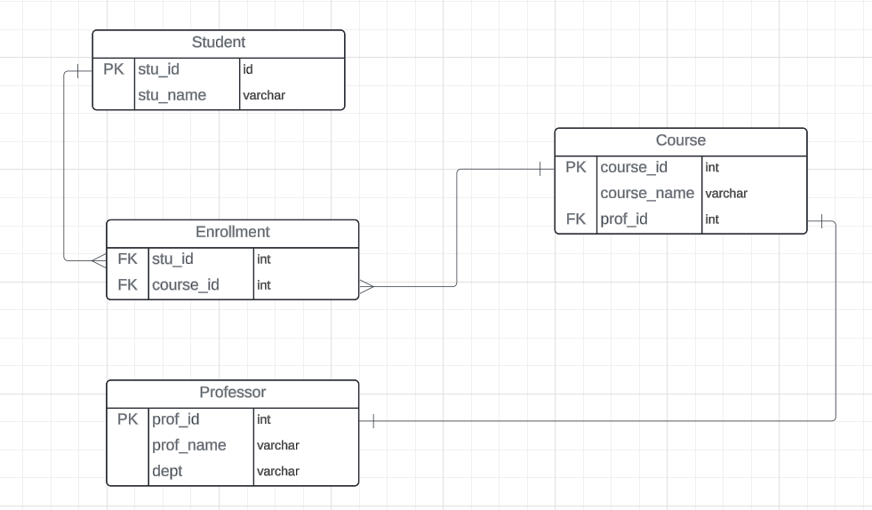

# Entity Relationship Diagram (ER DIagram)
- Visualize table in a database
- Everyone should be on the same page
- Normalize the Database to know how tables are related
- This increases the safety to the table
- why? Everyone can see and comment on this 

## Cardinality

## Entity
Real world Objects
## Attributes / Fields
Define the entity


# MSSQL
```sql
CREATE TABLE [Professor] (
  [professor_id] Varchar(255),
  [professor_name] Varchar(255),
  [department] Varchar(255),
  PRIMARY KEY ([professor_id])
);
 
 
CREATE TABLE [Student] (
  [student_id] Varchar(255),
  [student_name] Varchar(255),
  PRIMARY KEY ([student_id])
);
 
CREATE TABLE [Course] (
  [course_id] Varchar(255),
  [course_name] Varchar(255),
  [professor_id] Varchar(255),
  PRIMARY KEY ([course_id]),
  Foreign Key ([professor_id]) References Professor([professor_id])
);
 
 
CREATE TABLE [Enrollment] (
  [enroll_id] Varchar(255) ,
  [course_id] Varchar(255),
  [student_id] Varchar(255) ,
  PRIMARY KEY ([enroll_id]),
  Foreign Key ([course_id]) References Course([course_id]),
  Foreign Key ([student_id]) References Student([student_id])
);
 
 
INSERT INTO Professor (professor_id, professor_name, department)
VALUES ('P001', 'Dr. Brown', 'Mathematics'),
       ('P002', 'Dr. Smith', 'Physics');
 
 
INSERT INTO Student (student_id, student_name)
VALUES ('S001', 'Alice'),
       ('S002', 'Bob'),
       ('S003', 'Charlie');
 
INSERT INTO Course (course_id, course_name, professor_id)
VALUES ('C001', 'Math 101', 'P001'),
       ('C002', 'Physics 101', 'P002');
 
 
INSERT INTO Enrollment (enroll_id, course_id, student_id)
VALUES ('E001', 'C001', 'S001'),
       ('E002', 'C002', 'S002'),
       ('E003', 'C002', 'S001'),
       ('E004', 'C001', 'S003');
```
