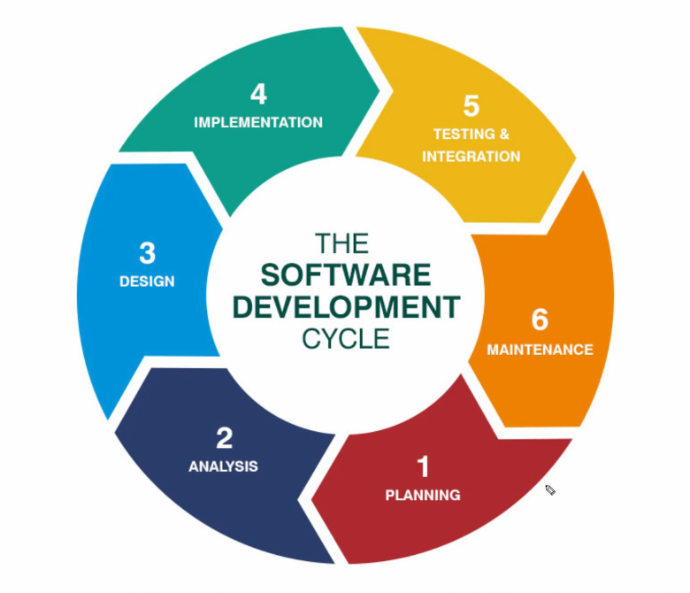

## Software Development Cycle

- Planning
    - Identify project objectives.
    - Gather requirements from stakeholders.
    - Establish timelines and resources.
    - Allocate roles and responsibilities.
- Analysis
    - Analyze gathered requirements in detail.
    - Identify potential risks and challenges.
    - Define system behavior and functionalities.
    - Create documentation such as user stories, use cases, and system requirements.
- Design
    - Architectural design: Define the overall structure of the system.
    - Detailed design: Specify the components, modules, and interfaces.
    - UI/UX design: Design the user interface and user experience.
    - Database design: Design the database schema and data flow.
- Implementation
    - Writing code according to the design specifications.
    - Follow coding standards and best practices.
    - Regular code reviews and collaboration with team members.
    - Version control to manage code changes.
- Testing and Integration
    - Unit testing: Test individual components/modules.
    - Integration testing: Verify interactions between components.
    - System testing: Validate the entire system against requirements.
    - User acceptance testing: Confirm that the system meets user expectations.
    - Bug fixing and regression testing: Ensure the existing functionalities are not affected
- Maintenance
    - Sustain and improve the software over time
    - Monitor performance and scalability.
    - Plan for future updates and iterations.

## Software Development phases
 

## Agile 
 - It is methadology
 - Adapt to changes
 - Efficient and move fast 
 - Iterative and incremental approach
 - Products delivered incrementally every 2 to 4 weeks

## Waterfall
 - Fixed
 - Good for civic project
 - Linear approach
 - Final product is delivered at the end of the development cycle

## Scrum
 Implementation of agile
## Sprint
 - Everybody will have their own sprint
 - Scrum master assign the task
 - Story points(fibonacci numbers) - how many days it will take to complete
 - 1st day planning for 2hrs
 - Standup Meeting for 15mins everyday
    - what I did yesterday
    - what I willdo today
    - if there is any blocker
 - Sprint retro for 1hr (review on what went wrong or right)

## Unified View
To check progress in a unified view, you can use project management tools or dashboards that provide a comprehensive overview of tasks, timelines, and progress.
 - Trello: Trello boards allow you to visualize tasks in lists or boards, providing a unified view of progress across different stages.
 - Jira: Jira provides customizable dashboards where you can create widgets to track progress, monitor sprint velocity, and view burn-down charts.

## Kandan Board
- Backlog: This column represents tasks that are planned but not yet started.
- In Progress: Tasks in this column are actively being worked on by team members.
- Peer Review: Tasks that have been completed or are nearing completion are moved to this column for peer review. Peer review ensures quality and accuracy before tasks are considered done.
- Done: Tasks that have been completed and meet the required criteria are moved to this column
